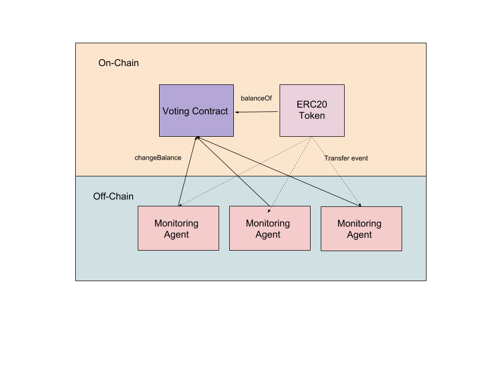

# FalseByte Carbon Voting

This code base demonstrates a simple trustless carbon voting solution.

The point of this project was to address the prblems provided by this [Aragon nest proposal](https://github.com/aragon/nest/issues/6). Which is meant to address the different tradeoffs between different token weighted voting systems. The different implementations are all centered around the Double Vote attack.

The double vote attack is when two colluding parties make it seem like they collectively own more ERC20 tokens than they really do. For example, say Alice has 10000 ColoradoCoin, and Bob has 10000 ColoradoCoin. Alice votes 'yes' and records her balance of 10000 tokens. She then tries to pull a fast one and transfers all of the tokens to Bob. He also votes 'yes', but with a recorded weight of 20000 tokens. This makes it look like collectively they both voted with a total of 30000 tokens, even though they really only have 20000 tokens.

Any token voting implementation must be designes in such a way to prevent this attack.
* Token Locking:
  - Solution: Force users to lock tokens in a contract for duration of voting period
  - Tradeoff: Creates risk for voting system and means users have to give up their tokens for a period of time.
* Snapshot:
  - Solution: Take snapshots of all voter token balances at each block. MiniMe.
  - Tradeoff: Even with optimizations done by MiniMe could have trouble scaling.
* Carbon Voting:
  - Solution: Voters emit an event which is counted offchain. No locking and no snapshots.
  - Tradeoff: Results can not be used on chain.

FalseByte Carbon Voting gets around all of the tradeoffs by implementing carbon voting onchain! They way it works is that voters send their votes with recorded token balances like normal. However, they can also run monitoring agents on their computer that are watching for votes and token transfers. It is assumed that since voters care about the results of their vote they are incentivized to run these agents on their computer. When a token transfer event occurs with one of the recorded voters a monitoring agent will update the recorded balance with the `changeBalance` method.

There is an interesting edge case at the end of the voting period, where a voter may try to vote at close to the end of the voting period. And since there is a delay for when transactions get confirmed in blocks, it could be that the balance was not able to updated in time. In order to compensate for this we allow for a grace period where new votes are not allowed to come in, but balances are able to be updated. To prevent the issue where a voter may try to change their balance during the grace period we only allow balances to be decremented during the grace period. If a voter tries to increase their token balance during the grace period the voting contract will not record this update.

<p align="center">
  
</p>

## Aragon Nest Deliverables

1. The proposal requests an off-chain tabulation procedure because carbon voting is typically done off-chain. This is also the reason they believed that something akin to the Truebit Verification game would be appropriate. The reason we didn't take this approach is simply because of the data availability problem. Solver's can not sum up unverified data. So the data that is used must go through a verification process (see [here](https://github.com/mrsmkl/eth-patricia/wiki/Offchain-tabulation-of-votes)). Since the data has to get verified on chain anyways, it is simpler to merely do the carbon voting on chain. That is why we went with the monitoring agents that update the balance. This is a simpler solution that still met the requirements. We believe this deliverable is mostly complete.

2. Integrating with AragonOS is still a work in progress. If you want to see the repo with work towards Aragon integration check out the `aragon` branch. We will most likely need additional help to work on this.

3. The generalized voting interface deliverable is dependent on the specific requirements. However, we have shown an example of a commit reveal approach that follows the same approach. There may need to be a few modifications needed, but we think it should be straight forward to extend our work using inheritance or composition.


## Installation Instructions

After cloning the repository

cd into the repo

```
cd falsebyte-carbon-voting
npm install
npm install -g truffle
```

Install test net:
```
npm install -g ganache-cli
```

Run your test net:
```
ganache-cli
```

Deploy contracts to test net:
```
truffle migrate --reset
```

# Usage

You can run through an example voting scenario using the cli with these instructions. We will be using truffle exec to run our scripts.

```bash
alias run="truffle exec cli.js"

# Begin by transferring 15000 ColoradoCoin to account 1

run transfer 1 15000

# Send tokens to rest of participants

run transfer 2 20000
run transfer 3 40000

# Start a super important election for 100 blocks
run election 'super important' 100
# This will output an electionID which we will need

# Start up a monitor agent in a separate tab
run monitor *electionID*

# Back in the original tab, lets send a vote
# Account 1 will vote yes (true)
run vote *electionID* true 1

# Account 1 and 2 will attempt to collude together by getting a double vote
# The attack requires account 1 to transfer their tokens to account 2 after voting
run transfer-from 1 2 15000

# Account 2 will now vote with 35000
# Thus the total votes yes LOOKS like it will be 50000
run vote *electionID* true 2

# Account 3 will vote no (false)
run vote *electionID* false 3

# We will skip the waiting period
run skip 120

# We can now get the results, and see that the monitoring agent actually updated the recorded balance on the ElectionSystem contract
run results *electionID*

# If all went well, the final tally should be yes: 35000 and no: 40000
```